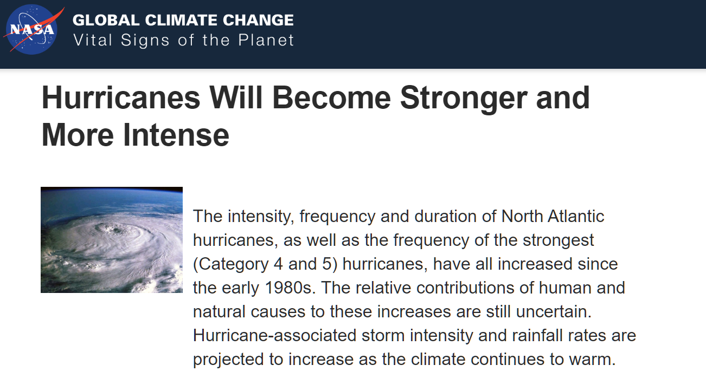

# The Truth Behind Global Warming | 164-year History of Hurricanes
Global Warming with its effects on human lives and other creatures on our planet has always been a controversial topic for the past many decades and no doubt would remain one of the hottest topics for many more years to come. One of the infamous effects of Global Warming is devastating storms. NASA claimed that due to Global Warming, "Hurricanes will become stronger and more intense". Whether this is true or not, let's explore and ask data to speak the truth.

# Overview
In this repository, there are total 4 total Jupyter Notebooks which were utilized for processing, cleaning up, analyzing and visualizations of tropical storms/ hurricanes data from 1851 – 2015.

Sources utilized for data, articles, and topic researches:
   - www.NASA.gov
   - www.NOAA.gov
   - www.Kaggle.com

## Workflow:
- "Team 4 Pseudo Codes.docx" : overview of project tasks and assigned members for each task

## Data Files: (folder: Database)
- Raw Atlantic Storm Data.csv (original downloaded 164 years hurricane data on Kaggle)
- Raw Atlantic Storm Data.csv (original downloaded 164 years hurricane data on Kaggle)
- new_data_atlantic.csv (final version of csv file post data-cleaning, ready for analysis)

## Jupyter Notebooks:
- Data_Cleaning_Codes : for processing and cleaning up ".csv" raw data
- Export to a new ".csv" file for further team analysis 
   
- OJ_Work.ipynb and OJ_Plots:   
   - Create PiePlot of Top 10 Hurricane Active Duration
   - Create Moving Average Line Plot of Hurricane (1851 - 2015)
    
- SSutar_Work.ipynb and SS_Plots:  
   - Categorize storms by windspeed
   - Create bar chart to show the category and how many time each occured (1851 - 2015)
   - Plot monthly distribtution of hurricanes (1851 - 2015)

- HLe_Work.ipynb and HL_Plots:  
   - Categorize hurricanes by windspeeds (binning techniques)
   - Create bar charts for categories # 3, 4, 5 hurricanes and number of occurence in the past for 25/ 50 yrs (1966-1991-2015)
   - Create box plot of all hurricane categories from 1 to 5: identify outliers, mean, standard errors
   - Create bar chart for observing tropical storm events in the past 50 years (1964 - 2015)
   - Create "gmaps" plot with add-on layer for showing locations of all hurricanes for the past 10 years (2005 - 2015)

## Project Team Presentation:
- File name : "Team_4_Proj_1.pptx"
- Overview of project ideas, teammembers, agenda
- Summary of results from all analyses performed, including data visualization 
- Conclusions, Challenges and Ideas for more future in-depth analyses

## Other Files: 
NASA_Glb_Wrmg.png : NASA article snapshot 
       

